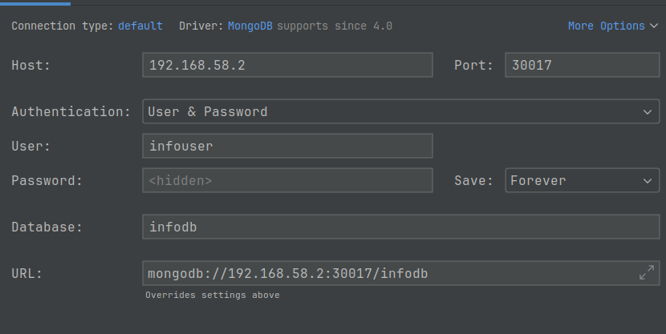

> [!WARNING]
>
> Manual is being formed

# renovation
Renovation reporter

## Using ##

### Config reverse nginx proxy for to redirect docker keycloak via local machine
(it's necessary for `docker compose` env. services works with security)  

- install and start nginx service  
- create a file /etc/nginx/conf.d/renovation-keycloak.conf  
```
server {
    listen      8080;
    server_name renovation-keycloak;

    location / {
	proxy_redirect      off;
	proxy_set_header    X-Real-IP $remote_addr;
        proxy_set_header    X-Forwarded-For $proxy_add_x_forwarded_for;
	proxy_set_header    Host $http_host;
	proxy_pass 	    http://127.0.0.1:18080/;
    }
}
```
- restart nginx to apply changes: `sudo service nginx restart`  

(also add to /etc/hosts/ file the record: `127.0.0.1	renovation-keycloak`)*

### for minikube it might be useful to make such nginx configs
(so that by such domain to access the ips locally)  

/etc/hosts:
```
#127.0.0.1       r l
192.168.49.2    mi k8s minikube mmii mmib
#192.168.58.2   mmi mk8s mminikube mmii mmib
192.168.55.3    mmi mk8s mminikube mmii mmib 
192.168.55.3    www.my web1.my web2.my webx.my cat.my myapps
```

load balancing (/etc/nginx/conf.d/milb.conf):
```
upstream backend {
#        least_conn;
        server 192.168.55.2:30080 weight=3;
        server 192.168.55.3:30082;
    }

    server {
        listen      80;
        server_name milb.com;

        location / {
	        proxy_redirect      off;
	        proxy_set_header    X-Real-IP $remote_addr;
	        proxy_set_header    X-Forwarded-For $proxy_add_x_forwarded_for;
	        proxy_set_header    Host $http_host;
		proxy_pass http://backend;
	}
}
```
forwarding (/etc/nginx/conf.d/micro.conf):
```
server {
    listen 8099;

    server_name micro.com;

    location / {
        proxy_pass http://192.168.55.4:30080;
    }
}
```

### Config project locally
1. Install `docker`, `docker compose`  
1.1. Install `minikube`  (last version)
1.2. Install `kubectl` (last version): https://kubernetes.io/docs/tasks/tools/install-kubectl-linux/
2. Install `JDK 21`  
3. (Import a maven project in IDEA: Project Structure -> Import module -> choose the folder with maven module) [Idea]  
4. Install and set node v16.14.0/npm 8.3.1  
4.4 With `nvm`: `$>nvm use v16.14.0`

### Working with project code

#### First after cloning repo config the githook for the project
Run a Gradle task from base module `renovation`:  
1. `$> gradle installGitHooks`  
2. Apply "Idea codestyle.xml" style in IDEA  

#### Build
* Build the project: `$> gradle buildAll` or `$> gradle ba`  
* Build with all checks: `$> gradle all`

#### Run the project in docker locally
1. Run locally: `$> docker-compose up`  
1.1. Run debug mode: `$> docker-compose -f docker-compose.yml -f docker-compose-debug.yml up`  
1.2. Run `sudo service nginx start` (it's needed for renovation-keycloak from docker works locally)  
[see: "Config reverse nginx proxy for to redirect docker keycloak via local machine"]
1.3. Open in browser: `localhost:8280`
---
(main services: backend, info, gateway with configured security)  
1. To run `RenovationApplication` without keycloak (no-security) set`no-security` profile
1.1. To run `InfoApplication` without keycloak (no-security) set`no-security` profile

* To run `RenovationApplication` in [Idea] previously: `dcu renovation-postgres, renovation-redis, renovation-keycloak` 

#### Run the 'no-security' profile Dockerfile(s):  
backend module (in /backend): `$> docker build -f no-security.Dockerfile -t koresmosto/renovation-backend:no-security .`  
info module (in /info): `$> docker build -f no-security.Dockerfile -t koresmosto/renovation-info:no-security .`  

up docker in no-security for `backend` and `info`:  
`$> dc -f docker-compose-no-security.yml up renovation-postgres renovation-redis renovation-mongo renovation-backend renovation-info`

#### Run a project with kubernetes
Install `kubectl`, `minikube`  

1. Run minikube a single-node cluster and deploy an app (backend, info) there:    
1.1. `$> sh auxiliary/deployment/minikube/single/1_single-cluster-creation.sh`  
2. Open service in browser:
backend: `localhost:30080`  
info: `localhost:30090`  
graphiql: http://192.168.58.2:30090/graphiql check (192.168.58.2 - cluster-ip on host)  
```
query{
      details{
        id
        name
        surname
        age
      }
    }
```
you can check a path: http://192.168.58.2:30090/api/v1/info
you can check a path: http://192.168.58.2:30090/api/v1/info/todo

connect postgres [user/pass: postgres/postgres1]: jdbc:postgresql://192.168.58.2:32000/postgres  
connect mongo:
  

to make work `renovation-ingress` on mmib and mmii write in /etc/hosts:  
192.168.58.2    mmii mmib  

Grafana http://192.168.58.2:31300  
user: admin  
pass: [see in logs of cluster (+ kubectl get secret ... -o jsonpath={.data.GF_SECURITY_ADMIN_PASSWORD})]  

Switch between HA postgress and simple:  
in `backend-deployment.yaml` for simple db use `key: POSTGRES_DB_URL` commend `key: POSTGRES_HA_DB_URL`
in `backend-deployment.yaml` for HA db use `key: POSTGRES_HA_DB_URL` commend `key: POSTGRES_DB_URL` 

and in `deploy-all.sh` comment/uncomment `../postgres-deploy.sh` and `../postgres-ha-deploy.sh`

#### Chart Releaser Action to Automate GitHub Page Charts
configured pushes automatically to `https://makeitfine-org.github.io/renovation/` 
as a helm chart version renewed (branch gh-pages)

Add helm repo:  
h repo add renovation_repo https://makeitfine-org.github.io/renovation

(https://makeitfine-org.github.io/renovation/)  
(https://helm.sh/docs/howto/chart_releaser_action/)  
(https://medium.com/@blackhorseya/step-by-step-guide-to-hosting-your-own-helm-chart-registry-on-github-pages-c37809a1d93f)  
(https://www.youtube.com/watch?v=x4IF7yyWw9g&ab_channel=DevOps4Solutions)  

#### Work with the cluster
- Install `stern` application of logs watching (https://docs.wakemeops.com/packages/stern/)  
autocompletion:
1. stern --completion bash > stern_completion.sh
2. sudo mv stern_completion.sh /etc/bash_completion.d/stern
3. source ~/.bashrc

examples:  
1. `stern .` # watch log of the entire app  
2. `stern backend` # watch log of backend

- Work with the single module:  
deploy from `a-deploy` only postgres in release:  
`$>yq eval '.postgres' values.yaml | helm install my-postgres ./charts/postgres -f - --dry-run`
- Deploy only postgres:  
`$>helm install my-db .   --set backend.enabled=false   --set redis.enabled=false   --set postgres.enabled=true`
`$>helm upgrade my-db .   --set backend.enabled=false   --set redis.enabled=false   --set postgres.enabled=true`
$
*redis connect:  
`$> kubectl exec -it <redis_pod_name> -- redis-cli`  
`$> kubectl exec -it <redis_pod_name> -- redis-cli -a <password>`  

*apply change in configmap/secret after upgrade:  
`$>kubectl rollout restart deployment my-app`

In this `helm` deployment you can only release all the app entirely (one name)
`helm upgrade --install my-db .   --set backend.enabled=false   --set redis.enabled=true   --set postgres.enabled=true --dry-run `

Useful commands: https://trello.com/c/pyHZmtQN/333-up-helm-k8s-in-minikube-with-terraform-renovation

Smoke tests for the cluster work after each deployment/redeployment (inside a-deploy/test):  
`$>./test.sh`

Partial install/upgrade:  
`$>helm install renovation . --set info.enabled=false` # no info module
`$> helm install renovation . --set info.enabled=`

1. build backend jar (skip any kind of test):  
`$> gr :backend:bootJar -x test -x integrationTest -x e2eTest`
2. build/upload images:  
`$> ./a-deploy/util/creat_upload_images.sh`
3. Remove unused charts 
`$>rm -rf charts/*.tgz Chart.lock`
`h dependency update && h install renovation .
4. Mongo:  
`$>mongosh -u infouser -p infopassword --authenticationDatabase infodb`
5. Activate in `a-deploy` dir > `a-deploy/util/helper/aliases.sh` to use some shortcuts
5.1. Activate in `secrets ` dir > `source ./util/secrets/pee.sh util/secrets/envvars_secret_for_deployment.json`
6. if [issue] db see `kg pv`, `kg pvc` (to clean content, clean cluster `/mnt/data/postgres/(master/replica)`)
7. To reuse pvc:  
`$>kubectl patch pv postgres-primary-0-pv -p '{"spec":{"claimRef": null}}'`  
`$>kubectl patch pv postgres-replica-0-pv -p '{"spec":{"claimRef": null}}'`

(https://chatgpt.com/s/t_68a1d41c6e908191b03890a03546498a)  
(https://chatgpt.com/s/t_68a1d472f61481919a6c413633c9c7e4)  

8. faster helm `re-install`:
`$>hun && sleep 30 && kpp && hi`

9. Unsealed vault in helm keys in file: `vault-cluster-vault-2025-08-19T18_44_54.481Z.json`

10. delete secret engine:
`kubectl exec -it -n security renovation-vault-0 -- sh`
inside:
`export VAULT_ADDR=http://127.0.0.1:8200`
`vault operator unseal 5553ed3b62cd99cb7a03b627d0bb0a1c351bfd1e135690138a2e859eef619c89`
`export VAULT_TOKEN=hvs.ELzor4mGdxJemZlqcep7glRn`  
`vault kv delete secret/myapp`  

11. Copy vault folder from minikube to host (backup):

- `go into \mnt\data` inside minikube  
- `sudo tar -czf /tmp/vault.backup.tar.gz vault`  
- `$>scp -o IdentitiesOnly=yes -i $(minikube ssh-key) docker@$(minikube ip):/tmp/vault.backup.tar.gz_1 \
 /tmp/vault.backup.tar.gz_1 vault.backup.tar.gz_1`

12. Restore `vault` folder on minikube use `a-deploy/resource/vault/vault.backup.tar.gz_1` (rename to `gz_1` to `gz`)  
13. Content of `envvars_secret_for_deployment.json` should be the same as vault secrets (renovation/secrets)  
13.1 On any update in above file do   
  `source ./util/secrets/pee.sh util/secrets/envvars_secret_for_deployment.json`  
   and update secrets in `vault`  
14. check if all namespaces deleted: `check_namespaces.sh`  
15. so shortcut to remove helm chart:   
`hun && sh util/helper/check_namespaces.sh && kpp && kpp`
16. Helm autcompletion: 
`helmfile completion bash > helmfile`  
`sudo mv helmfile /etc/bash_completion.d/`  
17. Update dependencies/build inside subchart:  
`h dependency build && hdu`  
18. 
- hi with ns: `hid --set vaultC.enabled=true --namespace security`    
- `hi --set vaultC.enabled=true --namespace security`  
- `hun --namespace security`  # and delete in -n security pvc
- un: `h uninstall renovation -n security && k delete -n security pvc data-renovation-vault-0 && kpp`

- un: `h uninstall renovation -n low && k delete -n low pvc data-renovation-vault-0 && kpp`
- in: `h install renovation . --set vaultC.enabled=true -n low --create-namespace`
- upd. deps: `sh /util/helper/update_dependencies.sh`  
- add repos: `https://charts.bitnami.com/bitnami` `https://helm.releases.hashicorp.com`

- ins\un:  
`h uninstall wolf && kpp && k delete -n low pvc ...`


DNS tool (https://chatgpt.com/s/t_68b17d8cf884819189c2acfe8d37a05b):  
start server:  
`kubectl run -i --tty dns-test --image=busybox:1.36 --restart=Never -- sh`
check name:  
`nslookup vaultrs.security.svc.cluster.local`
`wget -qO- http://vaultrs-vaultc.security.svc.cluster.local:8200/v1/sys/health`

Show key:value of secrets:  
`kubectl get secret extsecrets-secret -n security -o jsonpath='{.data}' | jq 'to_entries | .[] | "\(.key): \(.value | @base64d)"'`

To add/remove external-secrets in values.yaml add/remove to `global.secrets.namespaces:`

Install helm plugin:  
`helm plugin install https://github.com/jkroepke/helm-secrets`  
`export VAULT_ADDR="http://192.168.49.2:30820"`  
`export VAULT_TOKEN=$RENOVATION_VAULT_TOKEN`  
`vault kv get secret/renovation/secrets`  


===>  
===>  
===>  


Order of releasing (inst/uninst):
1) externalc:
`h install extrs . --set externalc.enabled=true -n security --create-namespace`  
`h -n security uninstall extrs`
  
2) add into ~/.bashrc:  
`export RENOVATION_TOKEN`  
`export RENOVATION_VAULT_UNSEAL_KEY`
`h install vaultrs . --set vaultc.enabled=true --set vaultc.vault.token=$RENOVATION_VAULT_TOKEN --set vaultc.vault.unsealKey=$RENOVATION_VAULT_UNSEAL_KEY -n security --create-namespace`
`h uninstall -n security vaultrs && sleep 40 && k -n security delete pvc data-vaultrs-0 && kpp && kg pv`
2.2) ? secrets (vault+external secrets):  
3) 
`h install secrets . --set global.secrets.enabled=true  -n security --create-namespace`
`h uninstall secrets`
4) Postgres:  
`h uninstall -n db postgresrs && k -n db delete pvc postgres-primary-0-pvc && k -n db delete pvc postgres-replica-0-pvc && kpvpg && kg pv`  


4. start `frontend`:
   `$>npm install && npm start`
5. start mid with live reload pages (instant refresh in browser):  
   `$>DEBUG=mid:* node app.js`
6. Debug frontend:  
   start server in debug mode:  
   `$>node --inspect ./node_modules/@vue/cli-service/bin/vue-cli-service.js serve`
   connect from Intellij idea: create debug/run config:   
   "debug javascript" > insert in url: "ws://127.0.0.1:9229/b727369a-1135-480a-9111-ad90f3c40a52" > run it in debug mode

### Heroku config:
Install heroku:  
https://devcenter.heroku.com/articles/heroku-cli#install-the-heroku-cli  
and java plugin: `heroku plugins:install java`  
1. login heroku:  
   `heroku login`
2. Deploy backend module (with jdk 21 specified) to heroku:  
   `heroku deploy:jar backend/build/libs/backend-0.0.1-SNAPSHOT.jar --jdk 21 --app newk7`
3. See heroku logs:  
   `heroku logs --tail --app aqueous-woodland-63249`
4. See heroku configs:  
   `heroku config`
5. app dashboard:  
   https://dashboard.heroku.com/apps/aqueous-woodland-63249
6. app url:  
   https://aqueous-woodland-63249.herokuapp.com/  

### Start frontend locally
1. run backend for api to work
2. set env. var `VUE_APP_BACKEND_API_URL` in frontend to backend api
   (e.g. if backend port is 8090: `export VUE_APP_BACKEND_API_URL=http://localhost:8090/api`)

### Integrate frontend prod build to backend:
1. On frontend run:  
`$>npm run build`
2. copy `dist/*` files to `backend/main/resources/public/*`
3. Run backend: `http://localhost:<port>/index.html`

See also:  
https://devcenter.heroku.com/articles/deploying-executable-jar-files  
https://devcenter.heroku.com/articles/deploying-spring-boot-apps-to-heroku
https://github.com/heroku/heroku-cli-deploy

### Usefull
1. build backend (skip any kind of test) + run jar (from backend module):  
`$>grcb -x test -x integrationTest -x e2eTest && java -jar build/libs/backend-0.0.1-SNAPSHOT.jar`
2. build project and copy dist to backend static resources:  
`$>gradle clean && gradle :frontend:npmInstall && gradle :frontend:npmBuild 
 && gradle :backend:clean && gradle :backend:compileJava && gradle copyDistToPublic 
 && gradle :backend:build`  
or just  
`$> gradle all`
3. backup db (mysql):
   `$> docker exec renovation-mysql /usr/bin/mysqldump -u root --password=... r2 > backup.sql`

### Use mockserver
From module mockapi run `docker-compose renovation-mockapi up`  
To add/update/delete requests modify config/initializer.json file  
See: https://github.com/makeitfine-org/renovation/issues/36  
Example: `curl http://localhost:1080/api/v1/name?surname=Mosto`

### Checkstyle (code check and auto-fix):
For to check:  
`$> gradle ktlintCheck`  
For to autofix:  
`$> gradle ktlintFormat`

### Work with Kubernetes  
1. Install docker-machine:  
   https://github.com/docker/machine/releases
2. Switch between "minikube" cluster (eval $(minikube docker-env)) and local env (eval $(docker-machine env -u))
3. Upload docker image from the local machine to the minikube cluster:  
   add minikube addon to upload docker images from local env to the cluster:
   `$> minikube addons enable registry`  
    Upload image to `minikube` cluster:  
   `$> minikube image load <IMAGE_NAME>`  
   Install helm:  
   https://helm.sh/docs/intro/install/  
4. Run api tests on the k8s cluster:  
   `$> gradle k8sApiTest`  
   (in gradle/scripts/k8sApiTest.sh BACKEND_SERVER_URL can be other, so change)  
   With ingress:  
   `$> gradle k8sIngressApiTest`
4.1 Instead of 5 - 9 belove steps execute script:   
   `$> sh auxiliary/deployment/minikube/mn-cluster-creation.sh`
5. Upload backend image and redeploy backend service:  
   `$> gradle k8sUploadBackendImage`  
6. Upload info image and redeploy backend service:  
   `$> gradle k8sUploadInfoImage`
7. Create on minikube cluster such dirs:  
   `/mnt/pg/data`, `/mnt/pg/init` (also place `backend/../db-init-scripts/*` folder content here)  
   `/mnt/mongo/data`, `/mnt/mongo/init` (also place `info/../init/*` folder content here)  

   `/mnt/pg-ha/init` (place `backend/../db-init-scripts/*` folder content here)  
   `/mnt/pg-ha/data-0` (make `sudo chown -R 1001:1001 data-0`),  
   `/mnt/pg-ha/data-1` (make `sudo chown -R 1001:1001 data-1`),  
   `/mnt/pg-ha/data-2` (make `sudo chown -R 1001:1001 data-2`),
   
   Or just copy `mn-cluster-content-creation.sh` to minikube `/mnt` and execute to create folders  
   7.1 Copy files to minikube: 
       `https://stackoverflow.com/questions/46086303/how-to-transfer-files-between-local-machine-and-minikube`  
   7.2 if to create multinode cluster create folders on each node:  
       `https://minikube.sigs.k8s.io/docs/tutorials/multi_node/`  
       ssh access to one of the multi-nodes (`mn` is name): `mi ssh -p m -n mn-m02`  
       upload images to multi-nodes: `mi image load <image> -p mn`  
8. Deploy/Undeploy all k8s entities scripts:  
   5.1.0 Create `renovation` namespace and make it current:   
   `$> kubectl apply -f auxiliary/deployment/k8s/yaml/renovation-namespace.yaml`  
   `$> kubectl config set-context --current --namespace=renovation`
   5.1.1 deploy:  
   `$> sh auxiliary/deployment/k8s/scripts/deploy-all.sh`  
   5.2 un-deploy:  
   `$> sh auxiliary/deployment/k8s/scripts/delete-all.sh`  
   (all necessary scripts and `kubectl` command can be read from above `sh` scripts)  
   8.1: work with postgres-ha:  
      https://devopscube.com/deploy-postgresql-statefulset/  
   8.2 Connect to `postgrs-ha-sts` pods:  
   `$>kubectl exec -it pg-client -n renovation -- /bin/bash`  
   `$>PGPASSWORD=postgres1 psql -h pgpool-svc -p 5432 -U postgres`  
   or  
   `$>PGPASSWORD=postgres1 psql -h postgres-ha-sts-1.postgres-ha-headless-svc.renovation.svc.cluster.local -p 5432 -U postgres`  
9. Config k8s (https://kubernetes.io/docs/tasks/access-application-cluster/ingress-minikube/):  
    9.1 Add minikube ip to /etc/hosts (example: `192.168.49.2    mi k8s minikube mii mib`)  
        (For multinode server add minikube ip to /etc/hosts (example: `192.168.49.2    mmi mk8s mminikube mmii mmib`)  
    9.2 `$>minikube addon ingress enable`  
    9.3 Apply ingress yaml  
10. Run bash for pod:  
    `$>kubectl exec -it <pod name> -- /bin/sh`  
11. Run helm grafana single-node on multi-cluster specify:  
    (https://tanzu.vmware.com/developer/guides/observability-prometheus-grafana-p1/)  
    execute command line commands:  
    `$>helm install prometheus bitnami/kube-prometheus`  
    (https://artifacthub.io/packages/helm/bitnami/grafana  
     https://tanzu.vmware.com/developer/guides/spring-prometheus/)  
    `$>helm install grafana  bitnami/grafana --set grafana.nodeSelector."<cluser>"=<label>`:  
    For example:  
    `helm install grafana bitnami/grafana --set grafana.nodeSelector."kubernetes\.io/hostname"=mn` 
      
    To config grafana:  
    > on create PROMETHEUS datasource use url from  
    `k describe service -n monitoring prometheus-kube-prometheus-prometheus`    
    Or access to prometheus (nodePort: 31909) and grafana (nodePort:31300)    
12. Open `minikube service`:  
   `$>minikube -p mn service backend --namespace renovation`
13. Test minikube with junit: 
   `$>gradle :api-test:minikube --tests "renovation.backend.api.test.minikube.MinikubeApiTest"`  
### Redis
* To evict/remove 'works' keys redis entities call on backend module server URL:  
  `/api/service/redis/work/evict`

### Frontend-info
* Run locally:  
  `$> npm run build`  
  `$> export VUE_APP_BACKEND_API_URL=http://localhost:8280/api`  
  `$> export VUE_APP_INFO_GRAPHQL_URL=http://localhost:9190`  
  `$> node docker.js`  
* Refresh with clearing cache short-cut: `Cntr+Shift+R`

### Run api test (local):
1) Run backend module locally
2) set env. var: `ACCESS_TOKENS_LOCALHOST=true` and `BACKEND_SERVER_URL=http://localhost:8080`
3) Run gateway locally bootTestRun (from root project):  
`$> ./gradle :gateway:bootTestRun`

### Access tokens from docker renovation network keycloak service:  
* http://localhost:8281/insecure/token/grant/password  
* http://localhost:8281/insecure/token/grant/client  

### Import users:  
`$> docker exec renovation-keycloak /opt/keycloak/bin/kc.sh export --dir /tmp/export --users different_files`  
`$> d exec -it renovation-keycloak sh`  
token with scopes (example):  
curl -X POST http://localhost:18080/realms/renovation-realm/protocol/openid-connect/token  
-H "Authorization: Bearer XXXX"  
--data "grant_type=urn:ietf:params:oauth:grant-type:uma-ticket"  
--data "audience=renovation-gateway-client"

todo: remove:  
https://www.keycloak.org/docs/latest/authorization_services/#_service_user_managed_access
https://medium.com/@bcarunmail/securing-rest-api-using-keycloak-and-spring-oauth2-6ddf3a1efcc2
https://docs.spring.io/spring-security/reference/reactive/oauth2/client/authorization-grants.html
https://wjw465150.gitbooks.io/keycloak-documentation/content/authorization_services/topics/service/authorization/authorization-api-aapi.html
https://access.redhat.com/documentation/en-us/red_hat_single_sign-on/7.2/html/authorization_services_guide/service_overview

See:
https://stackoverflow.com/questions/42186537/resources-scopes-permissions-and-policies-in-keycloak  
https://keycloak.discourse.group/t/spring-boot-keycloak-permission-based-on-authorization-scope-spring-security/23144/3  
https://www.keycloak.org/docs/latest/authorization_services/#_resource_overview

### Run modules:
#### mockapi:  
1) $>`docker-compose up renovation-mockup`
#### gateway:
1) $>`docker-compose up`  
2) Run GatewayApplication locally (See `SecurityConfig, ExposeApiConfig` for)  
application.yml change:
```
...
    port: ${MONGO_PORT:27117}
...
```
#### backend:
1) $>`docker-compose up`
2.1)  
   - Run RenovationApplication locally (config db params in app*.yml)
    See `application-secured-test.yml` permissions  
   application.yml change:
```
...
    url: "${POSTGRES_DB_URL:jdbc:postgresql://localhost:5532/postgres?currentSchema=renovation}"
...
    password: "${POSTGRES_PASSWORD:postgres1}"
...
    port: ${REDIS_PORT:6479}
...

```
   - Run subj. with csrf:  
SecurityConfig.kt change:
```
.csrf()
                .csrfTokenRepository(CookieCsrfTokenRepository.withHttpOnlyFalse())
                .and()
//                .disable() //todo: enable
```
Postman:  
2.2) Execute `Get`: `http://localhost:8080/api/work` with `Bearer Token` and `Test` tab:
```
let xsrfCookie = pm.cookies.get("XSRF-TOKEN")
pm.environment.set('xsrf-token', xsrfCookie)
```
2.2) Execute `Post`: `http://localhost:8080/api/work` with `Bearer Token` and `Test` tab:
```
let xsrfCookie = pm.cookies.get("XSRF-TOKEN")
pm.environment.set('xsrf-token', xsrfCookie)
```
and add `header`: `X-XSRF-TOKEN`=`{{xsrf-token}}`
#### api-test
Execute test `WorkControllerApiTest` locally in Idea:  
set `env. var`: `ACCESS_TOKENS_LOCALHOST=true`  
set `env. var`: `BACKEND_SERVER_URL=http://localhost:8080`

### Codestyle foramtter:
Enable editorconfig plugin in idea and enable editor config support for .editorconfig in root to work

- Code checkstayle check: `gradle ktlintCheck` && `gradle detekt`
- Code checkstayle format: `gradle ktlintFormat`

### Performance:
- https://httpd.apache.org/docs/2.4/programs/ab.html  
`$> ab -n 1600 -c 40 localhost:8080/async_result`


## Modules

### Temp
1) Run:  
`$> docker compose up renovation-vault-prepopulate`  
`$> ./gradlew :temp:bootRun`  
2) Token:  
`$> http POST :8080/token --auth test:test -v`  
3) Copy JWT token:  
4) http :8080/about 'Authorization: Bearer <JWT_TOKEN_HERE>'  

## Openapi (swagger) for backend module:  
$> api url: http://localhost:8080
$> Download open api yaml: http://localhost:8080/openapi.yaml

## social login (social-login profile of gateway module):  
env. vars `GITHUB_CLIENT_ID`, `GITHUB_CLIENT_SECRET`, `GOOGLE_CLIENT_ID`, `GOOGLE_CLIENT_SECRET`  
are in github actions secrets and env. vars

## certificates passwords (gateway > store):  
(check password: `$>keytool -list -keystore <keystorefile> -storepass <passwordtocheck>`)  
https://www.baeldung.com/x-509-authentication-in-spring-security  
rootCA         > 1234567  
localhost      > 12345  
keystore.jks   > 12345  
truststore.jks > 1234567  
clientTom.p12  > 12345678  
check keystore.jks password: `keytool -list -keystore keystore.jks -storepass 1234567`  
Run gateway with social-login & certificate (export oauth2 registration env. vars):  
`gr clean :gateway:bootRun -Psocial-login --args="--spring.profiles.active=social-login,cert"`  

## Usage

### Usage kafka (dc - docker compose):
`$> dcu renovation-kafka-ui`  

### Usage in Intellij idea
to run in intellij idea with `gradle buildAll` do so:  
1. set env. var JAVA_HOME in console to java 21: `export JAVA_HOME=<path>/jdk21`  
2. run IDEA in console `/bin/bash -l -c <path_to_idea>/bin/idea.sh`
3. Import maven project in IDEA: Project Structure -> Import module -> choose folder with maven module 

[backend-service](auxiliary/readme/backend-service.md)

### Add wiki submodule:  
g clone https://github.com/makeitfine-org/renovation.wiki.git wiki  
git submodule add https://github.com/makeitfine-org/renovation.wiki.git wiki  
git submodule update --init --recursive
status: git submodule status  
(help about submodules:  
https://www.youtube.com/watch?v=wTGIDDg0tK8&ab_channel=AntonPutra,  
https://www.freecodecamp.org/news/how-to-use-git-submodules/)  

### Remove submodule:  
$ git submodule deinit -f <submodule-name>
$ rm -rf <submodule-dir>
$ rm -rf .git/modules/<submodule-name>
$ git config -f .gitmodules --remove-section submodule.<submodule-name>
$ git config -f .git/config --remove-section submodule.<submodule-name>
$ git rm --cached <submodule-name>
$ git commit -m 'rm submodule: <submodule-name>'

generate access token in github Developer Settings (Personal access tokens (classic))
(ATTENTION: TAKEN CAN EXPIRE)

clone repo with submodules:  
`$ git clone --recurse-submodules git@github.com:makeitfine-org/renovation.git`
