# Renovation System Design Document

## Executive Summary

**Renovation** is a modern microservices-based application built to demonstrate enterprise-grade architecture patterns, security, and deployment strategies. The system implements a polyglot persistence approach with multiple specialized services, comprehensive security using OAuth2/OIDC, and production-ready deployment capabilities on both Docker Compose and Kubernetes platforms.

### Key Characteristics
- **Architecture**: Microservices with API Gateway pattern
- **Primary Language**: Kotlin with Spring Boot
- **Persistence**: Polyglot (PostgreSQL, MongoDB, Redis)
- **Security**: OAuth2/OIDC with Keycloak, Vault for secrets
- **Deployment**: Docker Compose, Kubernetes with Helm, Istio Service Mesh
- **Monitoring**: Prometheus, Grafana, Jaeger, Kiali, Loki
- **Frontend**: Vue.js 3 with Bootstrap

---

## 1. High-Level System Architecture

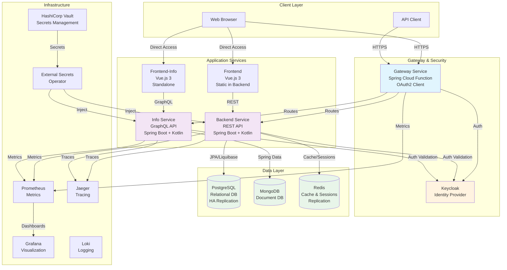

### Architecture Principles

1. **Microservices Pattern**: Each service has a single responsibility and can be deployed independently
2. **Polyglot Persistence**: Different databases optimized for specific use cases
3. **API Gateway**: Centralized entry point for routing and cross-cutting concerns
4. **Security First**: OAuth2/OIDC for authentication, centralized secrets management
5. **Observable**: Comprehensive monitoring, logging, and tracing
6. **Cloud Native**: Designed for containerized deployment on Kubernetes

---

## 2. Module Descriptions

### 2.1 Backend Module

**Purpose**: Main REST API service for renovation work management

**Technology Stack**:
- Spring Boot 3.2.0 with Kotlin
- PostgreSQL with Liquibase migrations
- Spring Data JPA with Hibernate 6.4
- Redis for caching and session management
- Spring Security with OAuth2 Resource Server
- OpenAPI/Swagger documentation (SpringDoc)
- Actuator for health checks and metrics
- Micrometer with Prometheus registry

**Key Features**:
- CRUD operations for work/renovation management
- Session management with Redis
- Database migration with Liquibase
- OAuth2/OIDC authentication and authorization
- RESTful API with comprehensive validation
- Health checks and metrics exposure
- Embeds Frontend Vue.js application

**API Endpoints** (sample):
- `GET/POST /api/work` - Work management
- `/actuator/*` - Health, metrics, info
- `/openapi.yaml` - API specification

**Database**: PostgreSQL with schema `renovation`

### 2.2 Info Module

**Purpose**: GraphQL API service for information/details management

**Technology Stack**:
- Spring Boot 3.2.0 with Kotlin
- MongoDB with Spring Data MongoDB
- Netflix DGS (Domain Graph Service) for GraphQL
- GraphQL Extended Scalars and Validation
- Spring Security with OAuth2 Resource Server
- Actuator for monitoring

**Key Features**:
- GraphQL API for querying details/info
- MongoDB document persistence
- OAuth2/OIDC authentication
- GraphQL schema-first development
- Code generation from GraphQL schema
- Custom scalar types (Age as Int)

**GraphQL Schema** (example):
```graphql
type Query {
  details: [Detail]
}

type Detail {
  id: ID!
  name: String!
  surname: String!
  age: Age
}
```

**Database**: MongoDB with database `infodb`

### 2.3 Gateway Module

**Purpose**: API Gateway and routing layer with authentication

**Technology Stack**:
- Spring Boot 3.2.0 with Kotlin
- Spring Cloud Function Web
- Spring Security with OAuth2 Client
- OAuth2 Resource Server
- Certificate-based authentication support
- Actuator for monitoring

**Key Features**:
- Request routing to backend services
- OAuth2/OIDC authentication handling
- Social login support (GitHub, Google)
- Certificate-based mutual TLS
- Token management and validation
- Insecure endpoints for testing (development)

**Configuration**:
- Supports multiple authentication methods
- Configurable routing rules
- Health check endpoints
- Token endpoint proxying

### 2.4 Frontend Module

**Purpose**: Main web UI for the application

**Technology Stack**:
- Vue.js 3.2
- Bootstrap 5.3
- Axios for HTTP requests
- Vuex 4 for state management
- Vue Router 4 for routing

**Key Features**:
- Single Page Application (SPA)
- Component-based architecture
- State management with Vuex
- Client-side routing
- REST API integration
- Responsive design with Bootstrap

**Deployment**: 
- Built and copied to `backend/src/main/resources/public`
- Served as static content from Backend service

### 2.5 Frontend-Info Module

**Purpose**: Dedicated UI for GraphQL Info service

**Technology Stack**:
- Vue.js 3.2
- Bootstrap 5.3
- Axios for HTTP requests
- Vuex 4 for state management
- Vue Router 4 for routing
- Keycloak-js 18.0 for authentication

**Key Features**:
- GraphQL client integration
- Keycloak authentication integration
- Standalone Node.js server deployment
- Environment-based configuration
- Component-based architecture

**Deployment**: 
- Runs as separate containerized service
- Node.js server (`docker.js`)
- Environment variables for backend URLs

### 2.6 Common Module

**Purpose**: Shared utilities and security components

**Components**:
- **Security/IAM**: Token management abstractions
  - `GrantTypeAccessToken` - Interface for OAuth2 grant types
  - `PasswordGrantTypeAccessToken` - Password grant implementation
  - `ClientCredentialsGrantTypeAccessToken` - Client credentials grant
  - `RequestPartyToken` - UMA token implementation
- **JWT Utils**: JWT parsing and validation
- **REST Utils**: HTTP client utilities
- **JSON Utils**: JSON serialization/deserialization
- **Date Utils**: Date/time utilities
- **Test Utils**: REST test initialization

**Technology**:
- Kotlin and Java mixed codebase
- Jackson for JSON processing
- Reusable across all Kotlin modules

### 2.7 API-Test Module

**Purpose**: Integration and E2E testing suite

**Technology Stack**:
- JUnit 5 (Jupiter)
- REST Assured with Kotlin extensions
- Testcontainers for integration tests
- Keycloak Testcontainer
- AssertJ for assertions

**Test Types**:
- **Unit Tests**: Fast, isolated tests
- **Integration Tests**: With Testcontainers
- **E2E Tests**: Full system tests with Docker Compose
- **Minikube Tests**: Kubernetes cluster tests

**Test Tags**:
- `test` - Unit tests
- `integrationTest` - Integration tests
- `e2eTest` - End-to-end tests
- `minikubeTest` - Kubernetes tests

---

## 3. Component Architecture

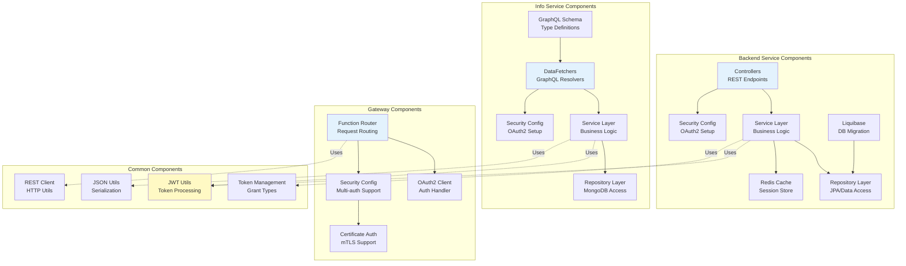

---

## 4. Data Architecture

### 4.1 Database Overview

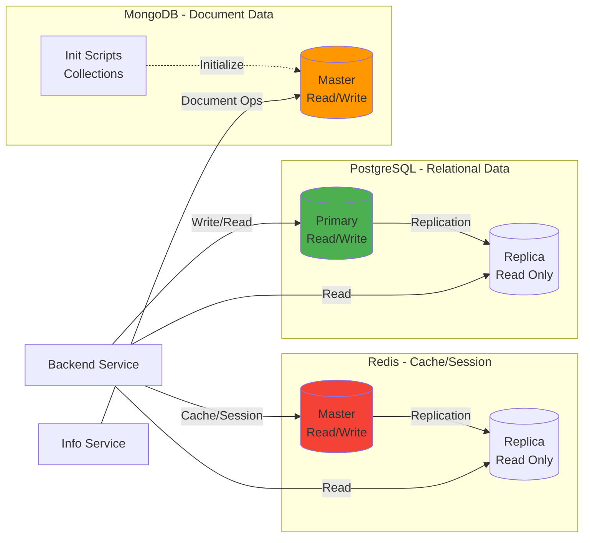

### 4.2 PostgreSQL Schema

**Database**: `postgres`  
**Schema**: `renovation`  
**Port**: 5432 (Docker: 5532, K8s: 30432)

**Key Tables** (managed by Liquibase):
- Work/Renovation entities
- User-related data
- Audit/tracking tables

**Features**:
- High Availability with Primary-Replica replication
- Automated migrations with Liquibase
- Connection pooling
- Schema isolation

### 4.3 MongoDB Schema

**Database**: `infodb`  
**Port**: 27017 (Docker: 27117, K8s: 30017)

**Collections**:
- Details/Info documents
- User details
- Dynamic schema support

**Features**:
- Document-oriented storage
- Flexible schema
- Initialization scripts on startup

### 4.4 Redis Configuration

**Port**: 6379 (Docker: 6479, K8s: 30379)

**Usage**:
- Session storage (Spring Session)
- Application caching
- Work entity caching

**Features**:
- Master-Replica replication
- Password authentication
- TTL-based eviction
- Max memory: 256MB

**Cache Keys**:
- `works` - Cached work entities
- Session keys managed by Spring Session

---

## 5. Security Architecture

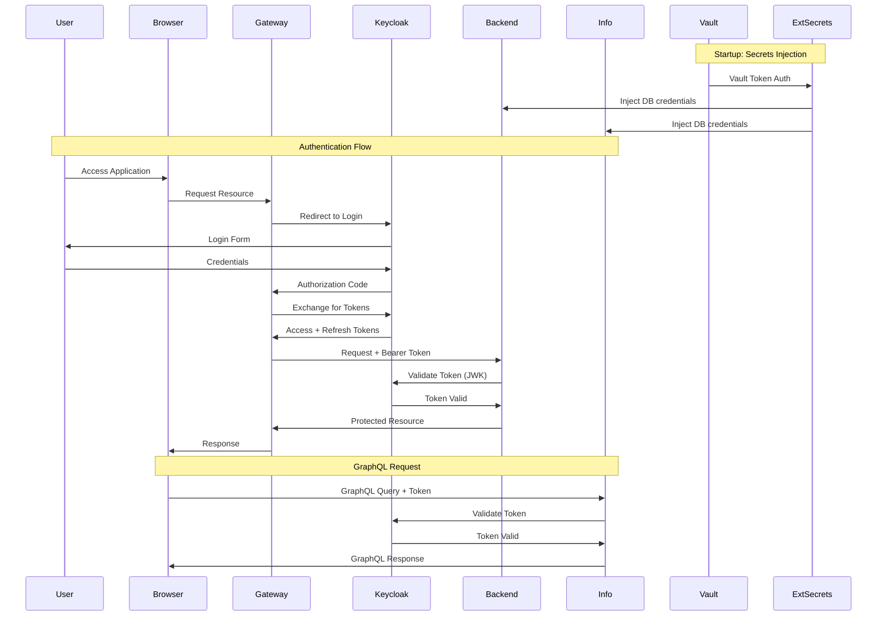

### 5.1 OAuth2/OIDC with Keycloak

**Keycloak Configuration**:
- **Realm**: `renovation-realm`
- **Port**: 8080 (Docker: 18080, K8s: 30080)
- **Version**: 18.0.2

**OAuth2 Flows**:
1. **Authorization Code** - Web applications
2. **Client Credentials** - Service-to-service
3. **Password Grant** - Testing/development
4. **UMA (User Managed Access)** - Fine-grained permissions

**Clients**:
- `renovation-gateway-client` - Gateway service
- `renovation-backend-client` - Backend service
- `renovation-info-client` - Info service

**Security Features**:
- JWT-based access tokens
- Token validation via JWK endpoint
- Role-based access control (RBAC)
- Resource-based permissions
- Social login (GitHub, Google)

### 5.2 Secrets Management

**HashiCorp Vault**:
- **Version**: Latest (Helm chart)
- **Storage**: Raft (persistent)
- **Port**: 8200 (K8s NodePort: 30820)
- **UI**: Enabled

**Vault Configuration**:
- Secret engine: KV v2
- Path: `secret/renovation/secrets`
- Auto-unseal support
- Persistent storage (1Gi)

**External Secrets Operator**:
- Syncs secrets from Vault to Kubernetes Secrets
- Automatic rotation support
- Multi-namespace deployment
- SecretStore per namespace

**Managed Secrets**:
- Database credentials (PostgreSQL, MongoDB)
- Redis password
- Keycloak admin credentials
- Service account tokens

### 5.3 Certificate-Based Authentication

**Gateway mTLS Support**:
- Client certificates (`.p12` format)
- TLS 1.2+ support
- Certificate validation
- Mutual authentication

**Certificates**:
- `rootCA` - Root CA (password: 1234567)
- `localhost` - Server cert (password: 12345)
- `keystore.jks` - Key store (password: 12345)
- `truststore.jks` - Trust store (password: 1234567)
- `clientTom.p12` - Client cert (password: 12345678)

---

## 6. Deployment Architecture

### 6.1 Docker Compose Deployment

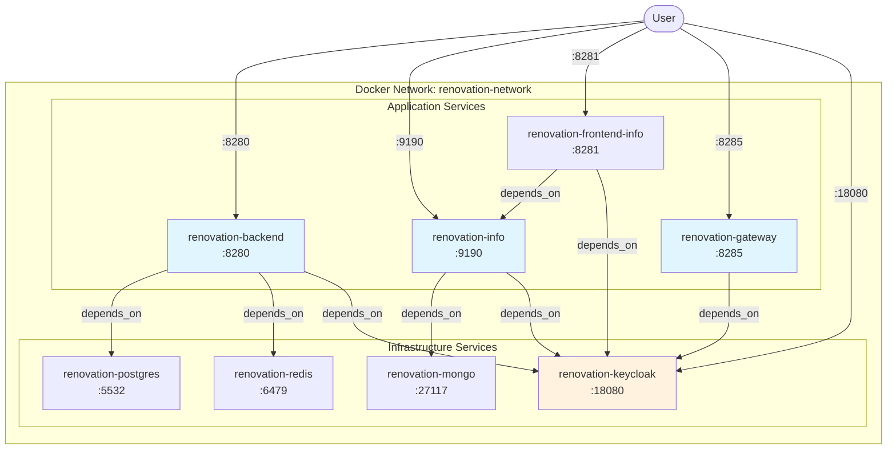

**Docker Compose Features**:
- Automated service orchestration
- Volume mounts for init scripts
- Environment variable configuration
- Health checks and restart policies
- Development and debug modes

**Compose Profiles**:
- `docker-compose.yml` - Full stack with security
- `docker-compose-no-security.yml` - No Keycloak
- `docker-compose-debug.yml` - Debug ports exposed

### 6.2 Kubernetes Deployment

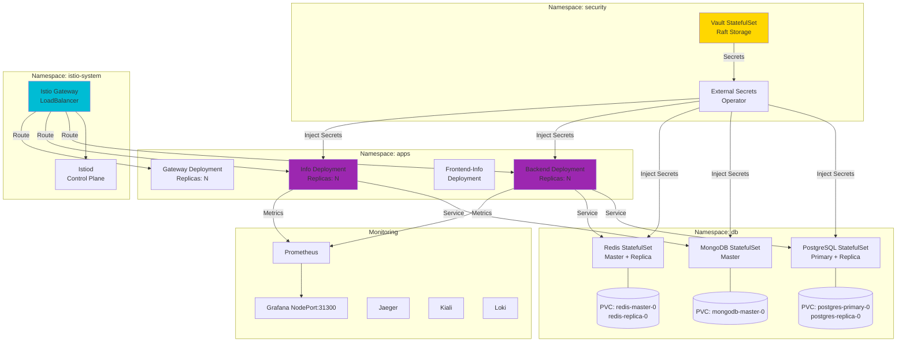

### 6.3 Helm Chart Structure

**Main Chart**: `a-deploy/`

**Dependency Charts**:
- `external-secrets-chart/` - External Secrets Operator
- `vault-chart/` - HashiCorp Vault
- `postgresql-chart/` - Bitnami PostgreSQL HA
- `mongodb-chart/` - Bitnami MongoDB
- `redis-chart/` - Bitnami Redis HA
- `backend/` - Backend service
- `info/` - Info service

**Namespaces**:
- `security` - Vault, External Secrets
- `db` - Databases (PostgreSQL, MongoDB, Redis)
- `apps` - Application services
- `istio-system` - Service mesh
- `monitoring` - Observability stack (optional)

**Values Configuration** (`values.yaml`):
```yaml
global:
  secrets:
    enabled: true/false
    vault:
      servicePath: "http://vaultrs.security.svc.cluster.local:8200"
    namespaces: [db, apps]

postgresqlc:
  enabled: true
  architecture: replication
  auth: # injected from Vault

redisc:
  enabled: true
  architecture: replication

mongodbc:
  enabled: true

backend:
  enabled: true
  replicas: 2

info:
  enabled: true
  replicas: 2
```

**Helm Release Process**:
1. Install External Secrets Operator
2. Install Vault with persistent storage
3. Configure Vault secrets
4. Install databases with HA
5. Deploy application services
6. Configure Istio Gateway

**Helper Scripts** (`a-deploy/util/`):
- `cluster/create_cluster.sh` - Create Minikube cluster
- `cluster/releasing_in_cluster.sh` - Deploy all components
- `cluster/uninstall_in_cluster.sh` - Clean up
- `helper/check_namespaces.sh` - Verify namespace cleanup
- `secrets/pee.sh` - Load secrets from JSON

### 6.4 Istio Service Mesh

**Components**:
- **Istio Base**: CRDs and base resources
- **Istiod**: Control plane (service discovery, config)
- **Istio Ingress Gateway**: Edge proxy (LoadBalancer)

**Features**:
- Traffic management (routing, load balancing)
- Security (mTLS between services)
- Observability (Jaeger integration)
- Circuit breaking and retries

**Gateway Configuration** (`gateway.yaml`):
- Virtual Services for routing
- Destination Rules for load balancing
- TLS termination

**Addons** (`a-deploy/resources/addons/`):
- `grafana.yaml` - Grafana dashboards
- `jaeger.yaml` - Distributed tracing
- `kiali.yaml` - Service mesh visualization
- `prometheus.yaml` - Metrics collection
- `loki.yaml` - Log aggregation

---

## 7. Data Flow Diagrams

### 7.1 Request Flow - REST API

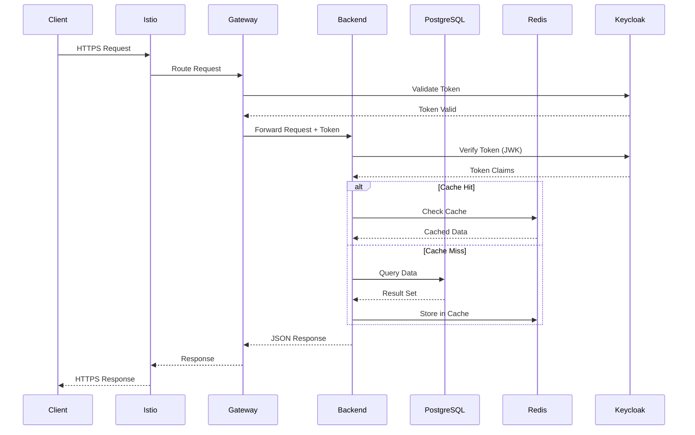

### 7.2 Request Flow - GraphQL API

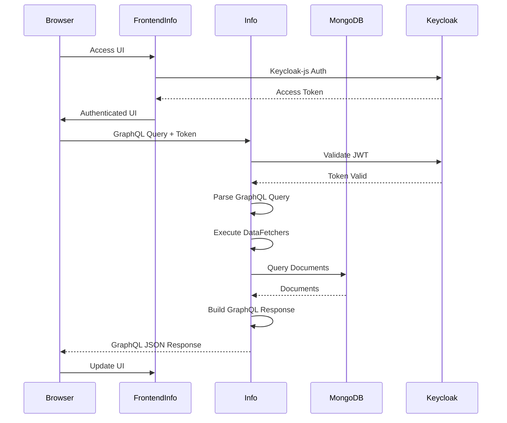

### 7.3 Service-to-Service Communication

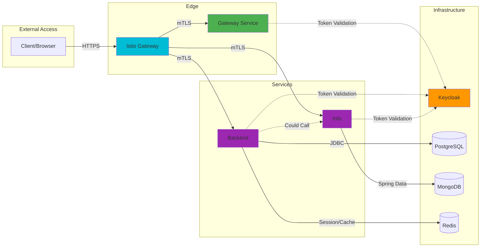

---

## 8. Infrastructure & Monitoring

### 8.1 Monitoring Stack

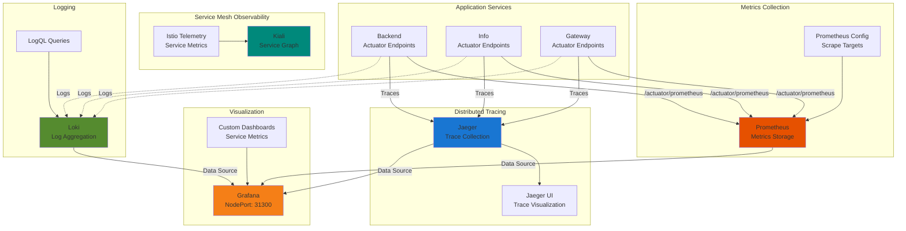

### 8.2 Observability Features

**Prometheus Metrics**:
- JVM metrics (heap, threads, GC)
- HTTP request metrics (count, duration)
- Database connection pool metrics
- Redis cache metrics
- Custom business metrics
- Istio service mesh metrics

**Grafana Dashboards**:
- Service health overview
- Request rate and latency
- Error rate tracking
- Database performance
- Cache hit/miss ratio
- JVM memory and CPU usage

**Jaeger Tracing**:
- End-to-end request tracing
- Service dependency mapping
- Latency analysis
- Error trace debugging

**Kiali Service Mesh**:
- Service topology visualization
- Traffic flow analysis
- Service health status
- Configuration validation

**Loki Logging**:
- Centralized log aggregation
- Label-based querying (LogQL)
- Integration with Grafana
- Service correlation

### 8.3 Health Checks

**Actuator Endpoints**:
- `/actuator/health` - Service health
- `/actuator/info` - Build info
- `/actuator/metrics` - Metrics endpoint
- `/actuator/prometheus` - Prometheus format

**Kubernetes Probes**:
- **Liveness Probe**: Checks if service is alive
- **Readiness Probe**: Checks if ready to serve traffic
- **Startup Probe**: Initial startup check

---

## 9. Build & CI/CD

### 9.1 Build System

**Gradle Multi-Module**:
- Kotlin DSL configuration
- Shared build logic in `build.gradle.kts`
- Module-specific configurations
- Dependency management with version catalogs

**Build Tasks**:
- `./gradlew buildAll` - Full build with tests and Docker images
- `./gradlew test` - Unit tests
- `./gradlew integrationTest` - Integration tests
- `./gradlew e2eTest` - E2E tests with Docker Compose
- `./gradlew ktlintCheck` - Code style check
- `./gradlew ktlintFormat` - Auto-format code
- `./gradlew detekt` - Static analysis
- `./gradlew koverVerify` - Code coverage (100% target for backend)

**Frontend Build**:
- `npm run build` - Production build
- `copyDistToPublic` - Copy to backend resources

**Docker Images**:
- `koresmosto/renovation-backend`
- `koresmosto/renovation-info`
- `koresmosto/renovation-gateway`
- `koresmosto/renovation-frontend-info`

### 9.2 Testing Strategy

**Test Pyramid**:

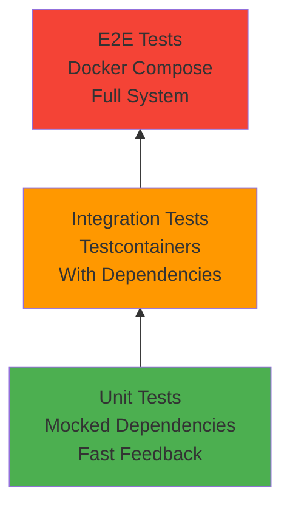

**Test Types**:

1. **Unit Tests** (`test` tag)
   - Fast, isolated
   - Mocked dependencies
   - High coverage requirement

2. **Integration Tests** (`integrationTest` tag)
   - Testcontainers (PostgreSQL, MongoDB, Keycloak)
   - Real database interactions
   - Security integration tests

3. **E2E Tests** (`e2eTest` tag)
   - Full Docker Compose stack
   - Real service interactions
   - End-to-end scenarios

4. **Minikube Tests** (`minikubeTest` tag)
   - Kubernetes cluster testing
   - Helm deployment validation
   - Service mesh testing

**Test Tools**:
- JUnit 5 (Jupiter)
- Mockk (Kotlin mocking)
- REST Assured (API testing)
- AssertJ (fluent assertions)
- Testcontainers (integration)

### 9.3 Code Quality

**Static Analysis**:
- **Ktlint**: Kotlin code style
- **Detekt**: Code smell detection
- **Checkstyle**: Additional checks

**Code Coverage**:
- Kover plugin (Kotlin coverage)
- 100% coverage target for backend
- Excludes: Application main, route controllers

**Security Scanning**:
- OWASP Dependency Check
- CVE vulnerability scanning
- Suppression file: `owasp-suppressions.xml`

**Git Hooks**:
- `commit-msg`: Message format validation
- `pre-push`: Run tests before push

---

## 10. Technology Stack Summary

### 10.1 Backend Technologies

| Category | Technology | Version | Purpose |
|----------|-----------|---------|---------|
| **Language** | Kotlin | 1.9.21 | Primary language |
| **Framework** | Spring Boot | 3.2.0 | Application framework |
| **Security** | Spring Security + OAuth2 | 3.2.0 | Authentication/Authorization |
| **Database** | PostgreSQL | 16.1 | Relational persistence |
| **ORM** | Hibernate | 6.4.0 | JPA implementation |
| **Migration** | Liquibase | Latest | Database versioning |
| **Cache** | Redis | 7.2.3 | Caching & sessions |
| **Session** | Spring Session Data Redis | 3.2.0 | Distributed sessions |
| **API Docs** | SpringDoc OpenAPI | 2.3.0 | API documentation |
| **Monitoring** | Micrometer + Prometheus | Latest | Metrics collection |
| **Testing** | JUnit 5 + Testcontainers | 5.10.1 / 1.19.3 | Testing framework |

### 10.2 Info Service Technologies

| Category | Technology | Version | Purpose |
|----------|-----------|---------|---------|
| **Language** | Kotlin | 1.9.21 | Primary language |
| **Framework** | Spring Boot | 3.2.0 | Application framework |
| **GraphQL** | Netflix DGS | 8.2.0 | GraphQL implementation |
| **Database** | MongoDB | 5.0.6 | Document database |
| **Data Access** | Spring Data MongoDB | 3.2.0 | MongoDB integration |
| **Security** | Spring Security + OAuth2 | 3.2.0 | Authentication |
| **Validation** | GraphQL Extended Validation | Latest | Input validation |

### 10.3 Gateway Technologies

| Category | Technology | Version | Purpose |
|----------|-----------|---------|---------|
| **Language** | Kotlin | 1.9.21 | Primary language |
| **Framework** | Spring Boot | 3.2.0 | Application framework |
| **Functions** | Spring Cloud Function Web | 2023.0.0 | Serverless functions |
| **Security** | OAuth2 Client + Resource Server | 3.2.0 | Authentication |
| **Certificate** | Spring Security TLS | 3.2.0 | mTLS support |

### 10.4 Frontend Technologies

| Category | Technology | Version | Purpose |
|----------|-----------|---------|---------|
| **Framework** | Vue.js | 3.2.26 | UI framework |
| **UI Library** | Bootstrap | 5.3.0 | Component library |
| **HTTP Client** | Axios | 1.7.3 / 0.24.0 | HTTP requests |
| **State Management** | Vuex | 4.0.2 | State management |
| **Routing** | Vue Router | 4.0.12 | Client routing |
| **Auth** | Keycloak-js | 18.0.1 | Authentication (Info) |
| **Build Tool** | Vue CLI | 5.0.8 / 4.5.15 | Build & dev server |

### 10.5 Infrastructure Technologies

| Category | Technology | Version | Purpose |
|----------|-----------|---------|---------|
| **Container** | Docker | Latest | Containerization |
| **Orchestration** | Kubernetes | Latest | Container orchestration |
| **Cluster** | Minikube | Latest | Local K8s cluster |
| **Package Manager** | Helm | Latest | K8s package manager |
| **Service Mesh** | Istio | Latest | Traffic management |
| **Identity** | Keycloak | 18.0.2 | IAM provider |
| **Secrets** | HashiCorp Vault | Latest | Secrets management |
| **Secrets Sync** | External Secrets Operator | Latest | K8s secrets sync |
| **Metrics** | Prometheus | Latest | Metrics storage |
| **Visualization** | Grafana | Latest | Dashboards |
| **Tracing** | Jaeger | Latest | Distributed tracing |
| **Service Graph** | Kiali | Latest | Mesh visualization |
| **Logging** | Loki | Latest | Log aggregation |

### 10.6 Build & Development Tools

| Category | Technology | Version | Purpose |
|----------|-----------|---------|---------|
| **Build Tool** | Gradle | 8.5 | Build automation |
| **JDK** | Java | 21 | Runtime environment |
| **Node.js** | Node | 16.14.0 | Frontend runtime |
| **NPM** | NPM | 8.3.1 | Package manager |
| **Linter** | Ktlint | 1.0.1 | Kotlin linting |
| **Static Analysis** | Detekt | 1.23.4 | Code quality |
| **Coverage** | Kover | 0.5.0 | Code coverage |
| **Security Scan** | OWASP Dependency Check | 7.2.0 | Vulnerability scan |
| **Benchmarking** | JMH | 1.37 | Performance testing |

---

## 11. Deployment Environments

### 11.1 Local Development (Docker Compose)

**Startup**:
```bash
docker-compose up
```

**Access URLs**:
- Backend: http://localhost:8280
- Info: http://localhost:9190
- Frontend-Info: http://localhost:8281
- Gateway: http://localhost:8285
- Keycloak: http://localhost:18080

**Features**:
- Quick startup
- Nginx proxy for Keycloak (renovation-keycloak:8080)
- Volume mounts for init scripts
- Debug mode support

### 11.2 Minikube (Single Node)

**Setup**:
```bash
sh auxiliary/deployment/minikube/mn-cluster-creation.sh
```

**Access**:
- Cluster IP: 192.168.49.2 (or similar)
- Services via NodePort
- Ingress via `/etc/hosts` mapping

**Features**:
- Local K8s testing
- Full Helm chart deployment
- Istio service mesh
- Monitoring stack

### 11.3 Kubernetes (Production)

**Setup**:
```bash
# Create cluster
sh a-deploy/util/cluster/create_cluster.sh

# Deploy all components
sh a-deploy/util/cluster/releasing_in_cluster.sh
```

**Namespaces**:
- `security` - Vault, External Secrets
- `db` - PostgreSQL, MongoDB, Redis
- `apps` - Application services
- `istio-system` - Service mesh
- `monitoring` - Observability (optional)

**Features**:
- HA database replication
- Auto-scaling support
- Istio traffic management
- Vault secrets injection
- Comprehensive monitoring

**Cleanup**:
```bash
sh a-deploy/util/cluster/uninstall_in_cluster.sh
```

---

## 12. API Documentation

### 12.1 Backend REST API

**OpenAPI Specification**:
- URL: http://localhost:8280/openapi.yaml
- UI: SpringDoc provides interactive API documentation

**Sample Endpoints**:
```
GET    /api/work              - List all works
POST   /api/work              - Create new work
GET    /api/work/{id}         - Get work by ID
PUT    /api/work/{id}         - Update work
DELETE /api/work/{id}         - Delete work
GET    /api/service/redis/work/evict - Clear cache
GET    /actuator/health       - Health check
GET    /actuator/prometheus   - Metrics
```

**Authentication**:
- Bearer token (OAuth2 Access Token)
- Header: `Authorization: Bearer <token>`

### 12.2 Info GraphQL API

**GraphiQL Interface**:
- URL: http://localhost:9190/graphiql

**Sample Queries**:
```graphql
query GetDetails {
  details {
    id
    name
    surname
    age
  }
}

query GetDetail($id: ID!) {
  detail(id: $id) {
    id
    name
    surname
    age
  }
}
```

**Authentication**:
- Bearer token in HTTP header
- Keycloak JWT validation

### 12.3 Gateway Endpoints

**Routes**:
- Routes to Backend service
- Routes to Info service
- Token management endpoints

**Insecure Endpoints** (Development):
```
POST /insecure/token/grant/password        - Get password grant token
POST /insecure/token/grant/client          - Get client credentials token
```

---

## 13. Performance & Scalability

### 13.1 Caching Strategy

**Redis Caching**:
- Work entities cached with TTL
- Cache eviction endpoint available
- Session storage for user sessions
- Distributed cache for multi-instance

**Benefits**:
- Reduced database load
- Faster response times
- Session persistence across restarts

### 13.2 Database Replication

**PostgreSQL HA**:
- Primary for writes
- Replica for reads
- Automatic failover support
- Replication lag monitoring

**MongoDB**:
- Master for all operations
- Can be configured for replica sets
- Sharding support for scale

**Redis**:
- Master for writes
- Replica for reads
- Persistence with RDB snapshots

### 13.3 Horizontal Scaling

**Kubernetes Deployment**:
- Backend: Multiple replicas
- Info: Multiple replicas
- Gateway: Multiple replicas
- Load balancing via Istio
- Auto-scaling with HPA (Horizontal Pod Autoscaler)

**Stateless Services**:
- Session state in Redis
- No local file storage
- Externalized configuration

---

## 14. Development Workflow

### 14.1 Local Development Setup

**Prerequisites**:
1. JDK 21
2. Docker & Docker Compose
3. Node.js 16.14.0 / npm 8.3.1
4. (Optional) Minikube & kubectl
5. (Optional) Helm

**First-Time Setup**:
```bash
# Install Git hooks
./gradlew installGitHooks

# Build entire project
./gradlew buildAll

# Run in Docker
docker-compose up
```

**IDE Setup** (IntelliJ IDEA):
- Apply code style: `auxiliary/code/checkstyle/Idea codestyle.xml`
- Enable EditorConfig support
- Import Gradle project

### 14.2 Common Development Tasks

**Run Backend Locally**:
```bash
# Start dependencies
docker-compose up renovation-postgres renovation-redis renovation-keycloak

# Run backend
./gradlew :backend:bootRun
```

**Run Frontend Locally**:
```bash
cd frontend
npm install
export VUE_APP_BACKEND_API_URL=http://localhost:8080/api
npm run serve
```

**Run Tests**:
```bash
# Unit tests
./gradlew test

# Integration tests
./gradlew integrationTest

# E2E tests (requires Docker)
./gradlew e2eTest

# All tests + build
./gradlew all
```

**Code Quality**:
```bash
# Check code style
./gradlew ktlintCheck

# Auto-format
./gradlew ktlintFormat

# Static analysis
./gradlew detekt

# Coverage
./gradlew :backend:koverVerify
```

### 14.3 Debugging

**Debug Backend in Docker**:
```bash
docker-compose -f docker-compose.yml -f docker-compose-debug.yml up
```
- Debug port: 5005

**Debug Frontend**:
```bash
node --inspect ./node_modules/@vue/cli-service/bin/vue-cli-service.js serve
```
- Debug port: 9229
- Connect from IDE: ws://127.0.0.1:9229/<uuid>

---

## 15. Security Considerations

### 15.1 Authentication & Authorization

**OAuth2/OIDC Flow**:
- Authorization Code for web apps
- Client Credentials for services
- Token validation via JWK endpoint
- Token refresh support

**RBAC (Role-Based Access Control)**:
- Roles defined in Keycloak
- Spring Security role checks
- Method-level security annotations

**UMA (User Managed Access)**:
- Fine-grained permissions
- Resource-based access control
- User-managed sharing

### 15.2 Secrets Management

**Best Practices**:
- No secrets in code or configs
- Vault for centralized storage
- External Secrets for K8s injection
- Rotation support
- Audit logging

**Secrets Lifecycle**:
1. Store in Vault
2. Configure SecretStore (per namespace)
3. Create ExternalSecret resources
4. Auto-sync to K8s Secrets
5. Mount in pods as env vars

### 15.3 Network Security

**Service Mesh (Istio)**:
- mTLS between services
- TLS termination at gateway
- Traffic encryption
- Certificate management

**Kubernetes Network Policies**:
- Namespace isolation
- Pod-to-pod restrictions
- Ingress/egress rules

**Certificate-Based Auth**:
- Client certificates for mTLS
- Gateway certificate validation
- Trust store management

---

## 16. Troubleshooting Guide

### 16.1 Common Issues

**Docker Compose**:
- Services not starting: Check `docker-compose logs <service>`
- Port conflicts: Check ports in `.env` or `docker-compose.yml`
- Keycloak access: Ensure nginx proxy configured

**Kubernetes**:
- Pods not starting: `kubectl describe pod <pod-name>`
- Secrets not injected: Check ExternalSecret status
- PVC issues: Clean `/mnt/data` in Minikube
- Vault sealed: Unseal with key

**Database**:
- Connection failures: Verify credentials in Vault
- Migration errors: Check Liquibase changelogs
- Replication lag: Monitor PostgreSQL logs

### 16.2 Useful Commands

**Docker**:
```bash
# View logs
docker-compose logs -f <service>

# Rebuild image
docker-compose up -d --build <service>

# Clean up
docker-compose down
```

**Kubernetes**:
```bash
# Check pods
kubectl get pods -A

# View logs
kubectl logs -f <pod-name>

# Port forward
kubectl port-forward svc/<service> <local>:<remote>

# Execute in pod
kubectl exec -it <pod> -- sh

# Check secrets
kubectl get secret <name> -o jsonpath='{.data}'
```

**Helm**:
```bash
# List releases
helm list -A

# Upgrade release
helm upgrade <release> . -f values.yaml

# Rollback
helm rollback <release>

# Uninstall
helm uninstall <release>
```

**Vault**:
```bash
# Unseal
vault operator unseal <key>

# Get secret
vault kv get secret/renovation/secrets

# Set secret
vault kv put secret/renovation/secrets KEY=VALUE
```

---

## 17. Future Enhancements

### 17.1 Planned Features

1. **Event-Driven Architecture**
   - Apache Kafka integration
   - Event sourcing pattern
   - CQRS implementation

2. **Advanced Monitoring**
   - Custom business metrics
   - Alert rules (Prometheus)
   - SLO/SLI tracking

3. **Performance Optimization**
   - Database query optimization
   - GraphQL DataLoader for N+1
   - Advanced caching strategies

4. **Security Enhancements**
   - API rate limiting
   - DDoS protection
   - Enhanced RBAC with fine-grained permissions

5. **CI/CD Pipeline**
   - GitHub Actions workflows
   - Automated testing
   - Canary deployments
   - Blue/Green deployments

### 17.2 Scalability Roadmap

1. **Database Sharding**
   - Horizontal partitioning
   - Multi-region support

2. **Multi-Cluster Deployment**
   - Cross-region replication
   - Global load balancing

3. **Microservices Expansion**
   - Additional bounded contexts
   - Service registry (Eureka/Consul)
   - API versioning strategy

---

## 18. Conclusion

The Renovation project demonstrates a comprehensive, production-ready microservices architecture with:

- **Modern Tech Stack**: Kotlin, Spring Boot, Vue.js
- **Polyglot Persistence**: PostgreSQL, MongoDB, Redis
- **Security First**: OAuth2/OIDC, Vault, mTLS
- **Cloud Native**: Kubernetes, Helm, Istio
- **Observable**: Full monitoring and tracing stack
- **Tested**: Comprehensive testing strategy
- **Scalable**: Horizontal scaling, HA databases

This architecture provides a solid foundation for building enterprise applications with high availability, security, and observability requirements.

---

## Appendix

### A. Repository Information

- **Project Name**: Renovation
- **License**: Not commercial (2021-2025)
- **Repository**: GitHub (with wiki submodule)
- **Documentation**: This file + Usage.md

### B. Contact & Support

- Project maintained as non-commercial
- Documentation in progress (see Usage.md)
- Wiki available as Git submodule

### C. Related Documentation

- [Usage.md](Usage.md) - Operational guide
- [Project.xml](Project.xml) - IDE project config
- [auxiliary/code/readme/](auxiliary/code/readme/) - Additional docs
- Wiki submodule - Extended documentation

---

*Document Version: 1.0*  
*Last Updated: October 2025*  
*Generated for Renovation Project*

